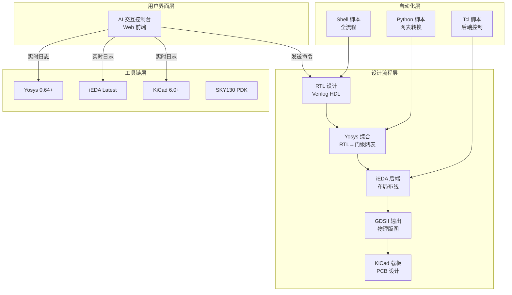
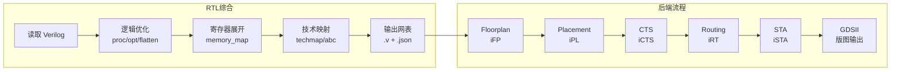
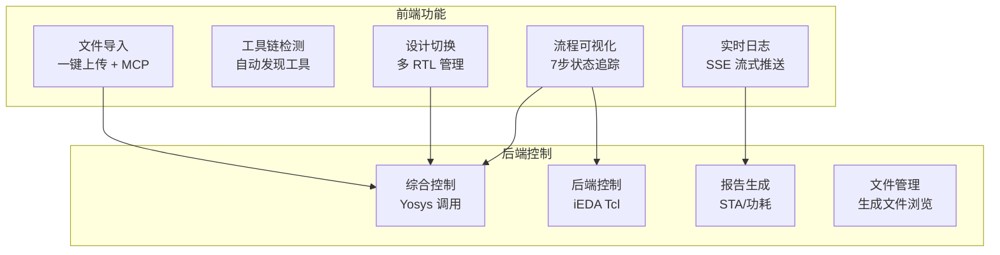

# 硅迹开源 (SiliconTrace Open)

> 一个中国大学生，不依赖任何商业软件License，仅凭开源工具和一台电脑，走完从芯片设计到板级验证的完整链路。

---

## 项目愿景

本项目是为了推动开源运动而进行的一个尝试，希望能够通过引入AI这种方式，让IC设计的门槛降低，让学习IC设计的门槛降低，并且也推动开源事业的发展。

我们相信：芯片设计不应该是少数人的特权。借助开源工具链和AI辅助，任何人都可以在一台普通的电脑上，完成从RTL代码到物理版图的完整芯片设计流程。

---

## 项目架构







---

## 详细目录结构

```
SiliconTrace_Open/
│
├── rtl/                              # RTL 源代码
│   └── picorv32/                     # PicoRV32 RISC-V 处理器核心
│       └── picorv32.v                # Verilog 源码 (3049行)
│
├── synthesis/                        # Yosys 综合
│   ├── synth.ys                      # 综合脚本 (含 memory_map)
│   ├── run_synth.sh                  # 综合运行脚本 (含网表修复)
│   ├── constraints/                  # SDC 时序约束
│   │   └── picorv32.sdc
│   └── results/                      # 综合输出
│       ├── picorv32_netlist.v        # 门级网表 (839KB)
│       └── picorv32_netlist.json     # JSON 网表 (2.9MB)
│
├── backend/                          # iEDA 后端流程
│   ├── config/                       # iEDA 配置文件
│   │   ├── pl_default_config.json    # 布局配置 (density=0.3)
│   │   └── rt_default_config.json    # 布线配置 (4线程)
│   ├── tcl/                          # iEDA Tcl 脚本
│   │   ├── run_iFP.tcl               # Floorplan 脚本
│   │   ├── run_iPL.tcl               # Placement 脚本
│   │   ├── run_iCTS.tcl              # CTS 脚本
│   │   ├── run_iRT.tcl               # Routing 脚本
│   │   ├── run_iSTA.tcl              # STA 脚本
│   │   └── run_def_to_gds.tcl        # GDSII 生成脚本
│   ├── run_ieda.sh                   # 后端全流程脚本
│   └── result/                       # 后端输出
│       ├── iFP_result.def            # Floorplan 结果
│       ├── iPL_result.def            # Placement 结果
│       ├── iCTS_result.def           # CTS 结果
│       ├── final_design.def          # 最终 DEF
│       ├── picorv32.gds2             # GDSII 物理版图 (87MB)
│       └── sta/                      # 时序报告
│           ├── picorv32.rpt
│           └── *.skew
│
├── scripts/                          # 自动化脚本
│   ├── yosys2ieda/                   # 网表/约束转换
│   │   ├── convert_netlist.py        # Yosys JSON → iEDA 格式
│   │   ├── convert_constraints.py    # SDC 约束合并
│   │   └── fix_netlist.py            # 修复复杂拼接赋值
│   ├── ieda_utils/                   # 报告工具
│   │   └── generate_report.py        # STA/功耗报告解析
│   └── automation/                   # 全流程脚本
│       ├── run_full_flow.sh          # RTL→GDSII 一键运行
│       └── clean.sh                  # 清理生成文件
│
├── kicad/                            # KiCad PCB 设计
│   ├── test_board/                   # 测试载板
│   │   ├── test_board.kicad_pro      # 项目文件
│   │   ├── test_board.kicad_sch      # 原理图 (PicoRV32 + 外设)
│   │   └── test_board.kicad_pcb      # 四层 PCB Layout (40x30mm)
│   ├── symbols/                      # 原理图符号库
│   │   └── picorv32.kicad_sym        # PicoRV32 符号
│   └── footprints/                   # 封装库
│       └── QFN-48_7x7mm_P0.5mm.kicad_mod  # QFN-48 封装
│
├── frontend/                         # AI 交互控制台
│   ├── app.py                        # Flask 后端 (命令解析、状态管理)
│   └── templates/
│       └── index.html                # Web 前端 (流程可视化、日志面板)
│
├── docker/                           # Docker 环境
│   ├── Dockerfile                    # EDA 工具链镜像
│   └── docker-compose.yml            # Docker Compose 配置
│
├── tests/                            # 测试
│   ├── simulation/                   # 仿真测试
│   │   ├── tb_picorv32.v             # 测试平台
│   │   ├── test.hex                  # 测试程序
│   │   └── Makefile
│   └── formal/                       # 形式验证
│       ├── picorv32.sby              # SymbiYosys 配置
│       └── properties.v              # 形式验证属性
│
├── docs/                             # 文档
│   ├── COMMANDS.md                   # 完整命令手册
│   ├── blog/                         # 技术博客
│   └── tutorials/                    # 教程 (4篇)
│
├── uploads/                          # 用户上传文件
│   ├── rtl/                          # 上传的 RTL 设计
│   ├── footprints/                   # 上传的封装
│   └── symbols/                      # 上传的符号
│
├── README.md                         # 本文件
├── USAGE.md                          # 使用说明
├── PROGRESS.md                       # 进度记录
├── .gitignore
└── .github/workflows/                # CI 配置
```

---

## 核心工具链

| 工具 | 用途 | 版本 | 开源协议 |
|------|------|------|----------|
| **Yosys** | RTL 综合 (Verilog → 门级网表) | 0.64+ | ISC |
| **iEDA** | 国产开源数字后端平台 | Latest | Apache 2.0 |
| **KiCad** | 开源 PCB 设计 | 6.0+ | GPL |
| **SKY130 PDK** | SkyWater 130nm 工艺设计套件 | sky130A | Apache 2.0 |
| **Volare** | PDK 版本管理工具 | 0.20+ | MIT |
| **Icarus Verilog** | Verilog 仿真器 | 11.0+ | GPL |
| **SymbiYosys** | 形式验证工具 | Latest | ISC |

---

## 快速开始

### 方式一：直接构建 (推荐学习)

适合希望深入了解每一步流程的学习者。

#### 1. 系统依赖安装

```bash
# 更新系统
sudo apt update && sudo apt upgrade -y

# 安装基础依赖
sudo apt install -y build-essential cmake git curl wget python3 python3-pip

# 安装 EDA 相关依赖
sudo apt install -y libboost-all-dev libeigen3-dev libgoogle-glog-dev \
    libgflags-dev libtbb-dev libgtest-dev libgmp-dev tcl-dev tk-dev \
    flex bison autoconf automake libtool pkg-config

# 安装 KiCad
sudo apt install -y kicad
```

#### 2. 安装 Yosys

```bash
# 方法 1: apt 安装 (推荐)
sudo apt install -y yosys

# 方法 2: 源码编译
git clone https://github.com/YosysHQ/yosys.git
cd yosys && make -j$(nproc) && sudo make install
```

#### 3. 安装 iEDA

```bash
cd ~
git clone https://github.com/OSCC-Project/iEDA.git
cd iEDA
mkdir build && cd build
cmake ..
make -j1  # 约 30-60 分钟，使用 -j1 避免内存不足
```

#### 4. 安装 SKY130 PDK

```bash
pip3 install volare
volare enable --pdk sky130
```

#### 5. 配置环境变量

```bash
cat >> ~/.bashrc << 'EOF'
export PDK_ROOT=$HOME/.volare
export IEDA_ROOT=$HOME/iEDA
export IEDA_BIN=$IEDA_ROOT/scripts/design/sky130_gcd/iEDA
export PATH=$IEDA_ROOT/scripts/design/sky130_gcd:$PATH
EOF
source ~/.bashrc
```

#### 6. 运行完整流程

```bash
cd ~/SiliconTrace_Open

# 方式 A: 使用一键脚本
bash scripts/automation/run_full_flow.sh

# 方式 B: 使用 AI 交互控制台
pip3 install flask flask-cors
python3 frontend/app.py
# 浏览器访问: http://localhost:5000
```

#### 7. 分步运行

```bash
# 步骤 1: 综合
bash synthesis/run_synth.sh

# 步骤 2: 后端全流程
bash backend/run_ieda.sh

# 步骤 3: 查看结果
ls artifacts/synthesis/          # 综合网表
ls artifacts/backend/             # 后端版图
klayout artifacts/backend/picorv32.gds2  # 查看 GDSII
```

---

### 方式二：Docker 构建 (推荐部署)

适合希望快速搭建环境或在多台机器上复现的用户。

#### 1. 安装 Docker

```bash
# 安装 Docker
sudo apt-get update
sudo apt-get install -y ca-certificates curl gnupg lsb-release

# 添加 Docker GPG 密钥和源
sudo mkdir -p /etc/apt/keyrings
curl -fsSL https://download.docker.com/linux/ubuntu/gpg | sudo gpg --dearmor -o /etc/apt/keyrings/docker.gpg
echo "deb [arch=$(dpkg --print-architecture) signed-by=/etc/apt/keyrings/docker.gpg] \
  https://download.docker.com/linux/ubuntu $(lsb_release -cs) stable" | \
  sudo tee /etc/apt/sources.list.d/docker.list > /dev/null

# 安装 Docker Engine
sudo apt-get update
sudo apt-get install -y docker-ce docker-ce-cli containerd.io docker-compose-plugin

# 将用户添加到 docker 组
sudo usermod -aG docker $USER
newgrp docker
```

#### 2. 构建 Docker 镜像

```bash
cd ~/SiliconTrace_Open

# 构建包含所有 EDA 工具的镜像
docker compose -f docker/docker-compose.yml build
```

#### 3. 启动环境

```bash
# 启动 EDA 环境 + AI 前端
docker compose -f docker/docker-compose.yml up -d

# 进入 EDA 容器
docker exec -it silicontrace-eda bash

# 在容器内运行全流程
bash scripts/automation/run_full_flow.sh
```

#### 4. 访问 AI 控制台

```bash
# 启动前端服务
docker compose -f docker/docker-compose.yml up frontend

# 浏览器访问: http://localhost:5000
```

#### 5. 使用预构建镜像 (如果可用)

```bash
# 拉取镜像
docker pull yourusername/silicontrace:latest

# 启动
docker compose -f docker/docker-compose.yml up -d
```

---

## AI 交互控制台

硅迹开源提供了一个 Web 界面，让您可以通过交互式命令控制整个设计流程。

### 功能特性

- **流程可视化**: 实时显示 7 个设计步骤的状态 (综合 → Floorplan → Placement → CTS → Routing → STA → GDSII)
- **工具链检测**: 自动检测 Yosys、iEDA、KiCad、PDK 等工具的安装状态
- **实时日志**: 查看每一步的详细执行日志
- **设计切换**: 支持多个 RTL 设计之间的切换和管理
- **文件导入**: 支持导入自定义 RTL 设计、芯片封装、原理图符号
- **生成文件浏览**: 直接在前端查看后端生成的网表、DEF、GDSII 等文件
- **MCP 接口**: 提供程序化上传 API，支持 AI 代理调用

### 启动方式

```bash
pip3 install flask flask-cors
python3 frontend/app.py
```

浏览器访问: http://localhost:5000

### 可用命令

| 命令 | 说明 |
|------|------|
| `综合` / `synthesis` / `yosys` | 运行 Yosys 综合 |
| `floorplan` / `fp` / `布局规划` | 运行 Floorplan |
| `placement` / `pl` / `布局` | 运行 Placement |
| `cts` / `时钟树` | 运行 CTS |
| `routing` / `rt` / `布线` | 运行 Routing |
| `sta` / `时序分析` | 运行 STA |
| `gdsii` / `gds` | 生成 GDSII |
| `全流程` / `full flow` | 运行完整 RTL→GDSII 流程 |
| `status` / `状态` | 查看项目状态 |

### MCP 上传接口

```bash
# RTL 设计上传
curl -X POST http://localhost:5000/api/upload/mcp \
  -H "Content-Type: application/json" \
  -d '{
    "action": "import",
    "type": "rtl",
    "filename": "my_design.v",
    "content": "module my_design(...); endmodule",
    "encoding": "text",
    "design_name": "my_design"
  }'

# 芯片封装上传
curl -X POST http://localhost:5000/api/upload/mcp \
  -H "Content-Type: application/json" \
  -d '{
    "action": "import",
    "type": "footprint",
    "filename": "my_chip.kicad_mod",
    "content": "(module my_chip ...)",
    "encoding": "text"
  }'
```

---

## 输出文件说明

| 阶段 | 输出文件 | 大小 | 查看方式 |
|------|----------|------|----------|
| 综合 | `artifacts/synthesis/picorv32_netlist.v` | 839KB | Vim / VS Code |
| 综合 | `artifacts/synthesis/picorv32_netlist.json` | 2.9MB | Vim / VS Code |
| Floorplan | `artifacts/backend/iFP_result.def` | 5.1MB | KLayout |
| Placement | `artifacts/backend/iPL_result.def` | 5.3MB | KLayout |
| CTS | `artifacts/backend/iCTS_result.def` | 5.3MB | KLayout |
| GDSII | `artifacts/backend/picorv32.gds2` | 87MB | KLayout |
| STA | `artifacts/backend/sta/picorv32.rpt` | 53KB | Vim / VS Code |
| PCB | `kicad/test_board/test_board.kicad_pcb` | - | KiCad |

---

## 设计案例

### PicoRV32 RISC-V 处理器核心

- **工艺**: SKY130 130nm
- **设计规模**: ~3000 行 Verilog
- **Die 面积**: 1000μm × 1000μm
- **标准单元库**: sky130_fd_sc_hd (高密度)
- **布局密度**: 0.3
- **测试载板**: 4 层 PCB (40mm × 30mm)

---

## 参与贡献

欢迎提交 Issue 和 Pull Request！

### 贡献指南

1. Fork 本仓库
2. 创建特性分支 (`git checkout -b feature/AmazingFeature`)
3. 提交更改 (`git commit -m 'Add some AmazingFeature'`)
4. 推送到分支 (`git push origin feature/AmazingFeature`)
5. 创建 Pull Request

---

## 开源协议

本项目采用 [MIT License](LICENSE) 开源协议。

---

## 致谢

- [YosysHQ](https://github.com/YosysHQ) - 开源综合工具
- [iEDA](https://github.com/OSCC-Project/iEDA) - 国产开源数字后端平台
- [KiCad](https://www.kicad.org/) - 开源 PCB 设计工具
- [SkyWater PDK](https://github.com/google/skywater-pdk) - 130nm 工艺设计套件
- [PicoRV32](https://github.com/cliffordwolf/picorv32) - RISC-V 处理器核心

---

## 联系方式

- GitHub: [SiliconTrace_Open](https://github.com/ForBloodB/SiliconTrace_Open)
- B站: 硅迹开源
- 知乎: 硅迹开源
